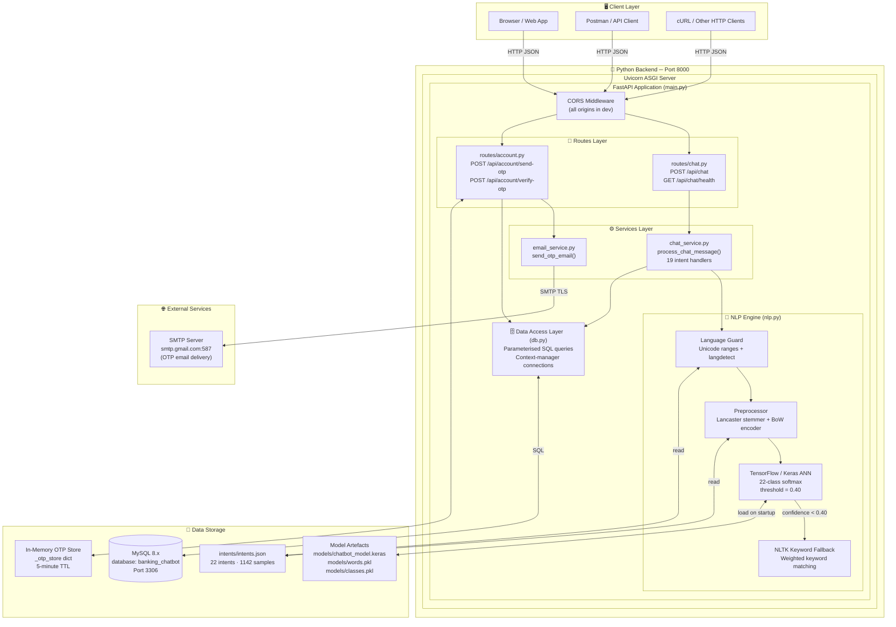
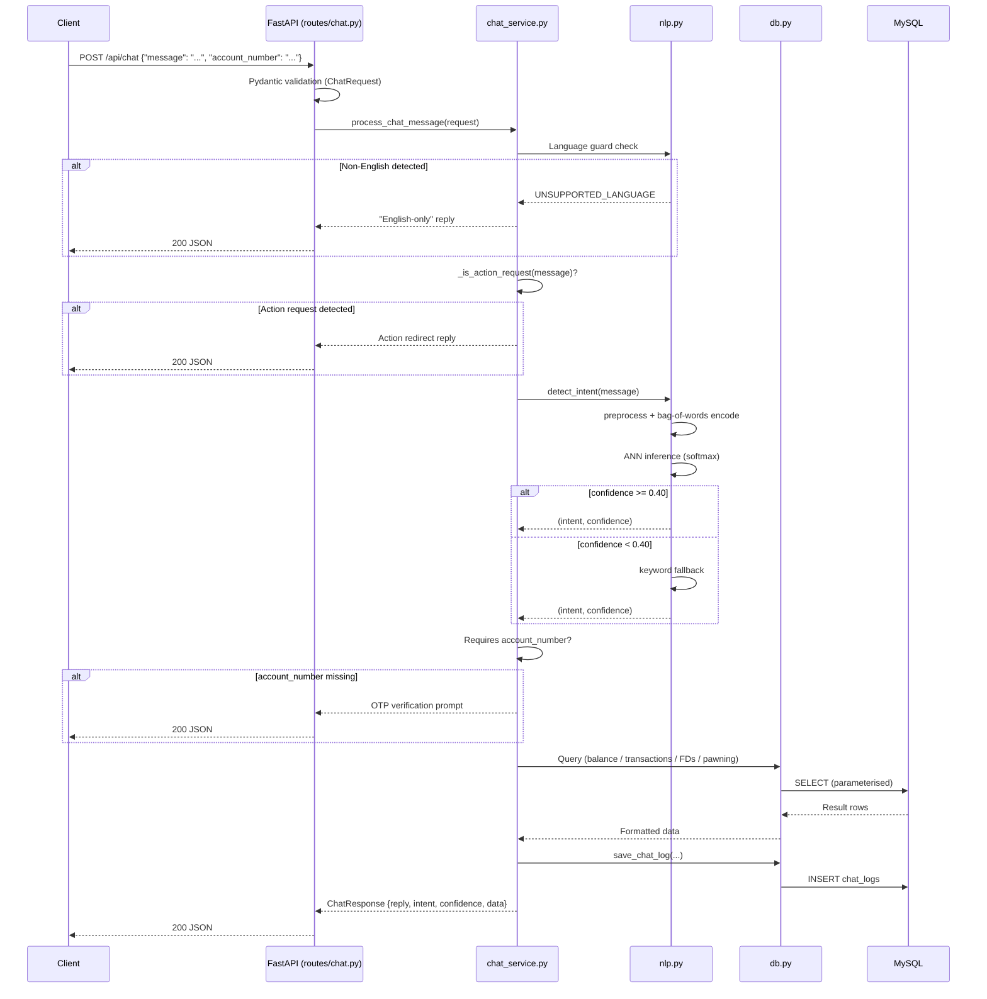
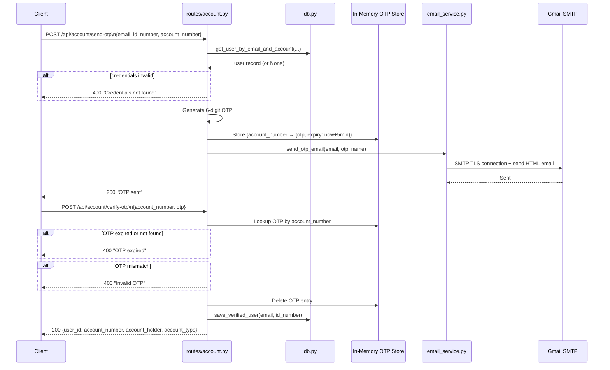
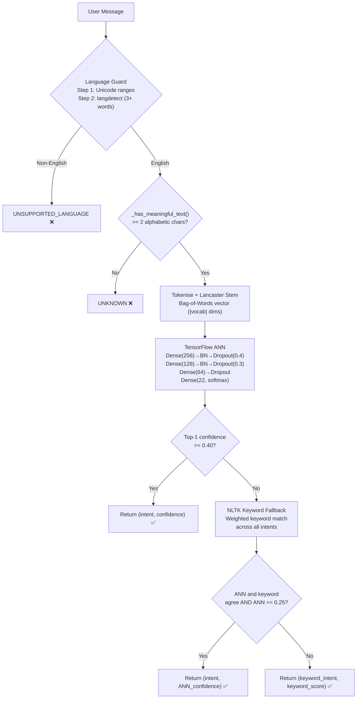
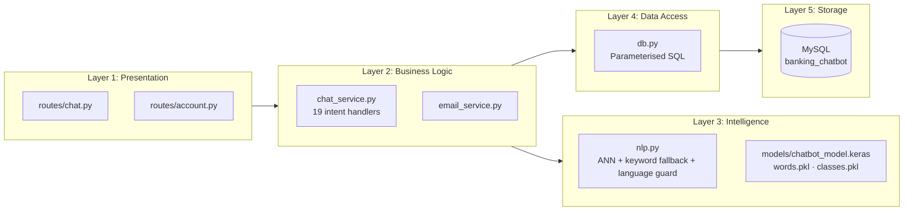

# Architecture Diagram — Smart Banking Assistant

## System Overview

The Smart Banking Assistant follows a **Layered Architecture** pattern with four distinct layers: Presentation, Business Logic, Data Access, and Data Storage. All communication is RESTful JSON over HTTP.

---

## High-Level Architecture

---

## Request Processing Pipeline

---

## OTP Verification Flow

---

## NLP Engine — Intent Detection Pipeline

---

## Layered Architecture Summary

---

## Technology Stack Summary

| Layer              | Technology                    | Version   |
| ------------------ | ----------------------------- | --------- |
| Runtime            | Python / CPython              | 3.10+     |
| ASGI Server        | Uvicorn                       | ≥ 0.30.0  |
| Web Framework      | FastAPI                       | ≥ 0.115.0 |
| Data Validation    | Pydantic                      | ≥ 2.10.0  |
| NLP Preprocessing  | NLTK (Lancaster stemmer)      | ≥ 3.8.1   |
| ANN Model          | TensorFlow / Keras 3          | ≥ 2.16.0  |
| Numerical Arrays   | NumPy                         | ≥ 1.26.0  |
| ML Utilities       | scikit-learn                  | ≥ 1.4.0   |
| Language Detection | langdetect                    | ≥ 1.0.9   |
| Database Driver    | mysql-connector-python        | 8.3.0     |
| Database Engine    | MySQL                         | 8.x       |
| Email Delivery     | smtplib (stdlib) + Gmail SMTP | built-in  |
| Config Management  | python-dotenv                 | 1.0.0     |
