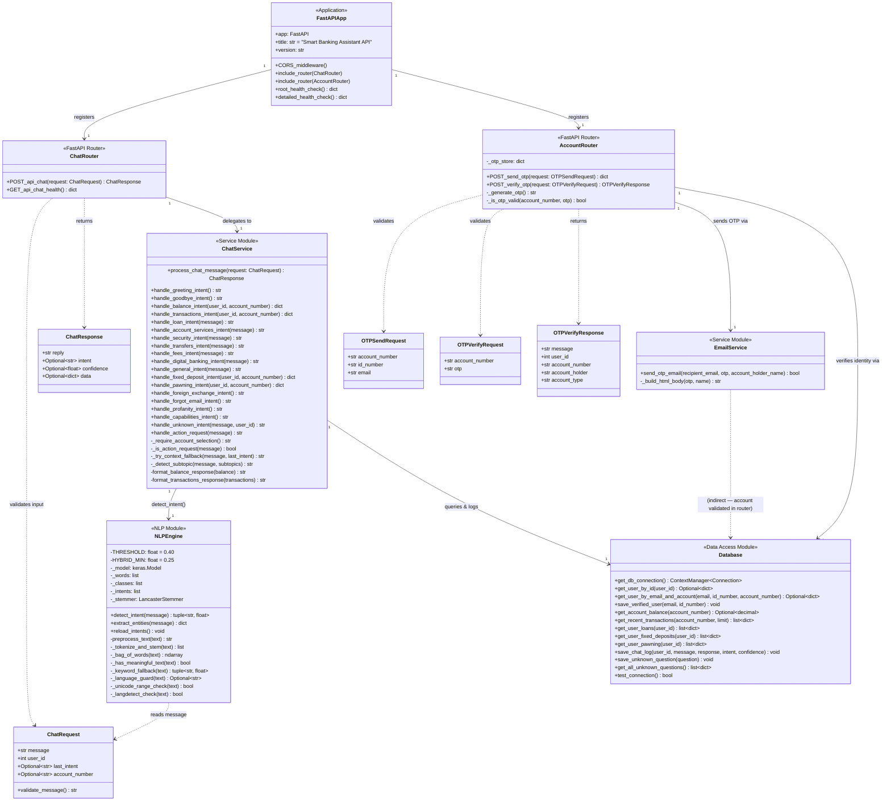
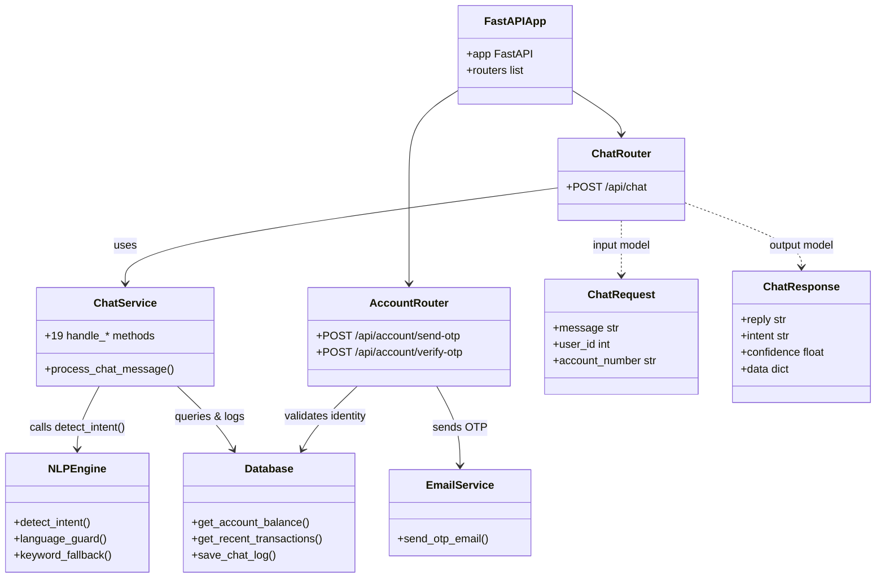
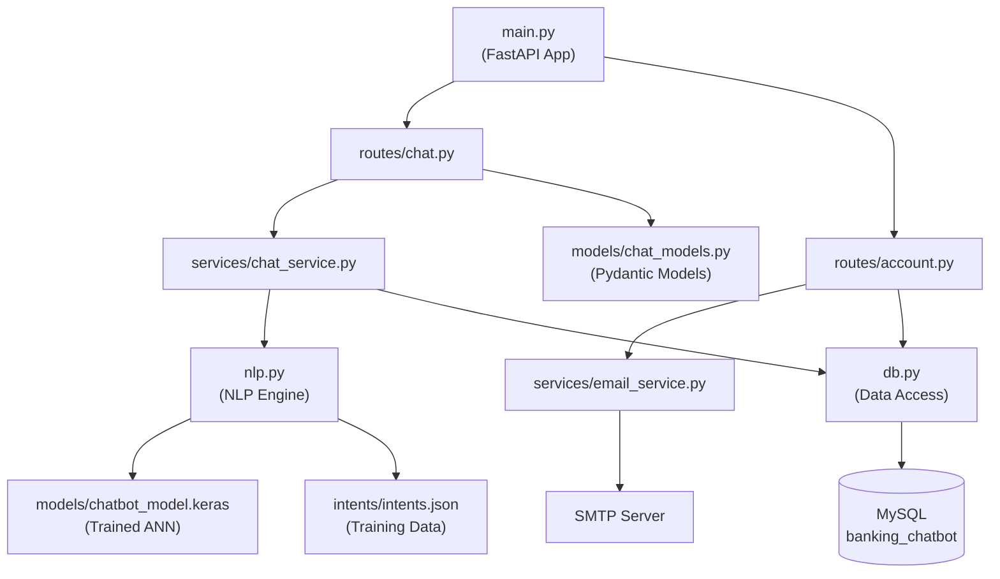

# Class Diagram — Smart Banking Assistant

## Overview

The project is structured around five main logical units: **API Models**, **Routes**, **Services**, **NLP Engine**, and **Data Access Layer**. Python does not enforce strict class-based OOP for every module — service logic is implemented as module-level functions rather than class instances — but the class diagram below accurately maps each module's public interface and relationships.

---

## Full Class Diagram

---

## Simplified Relationship View

---

## Module Dependency Graph

---

## Intent Handler Dispatch Table

The `process_chat_message()` function routes detected intents to handlers in the following order:

| Priority | Intent                                                  | Handler                            | Auth Required              |
| -------- | ------------------------------------------------------- | ---------------------------------- | -------------------------- |
| 1        | Language guard                                          | _(returns early)_                  | No                         |
| 2        | Action request                                          | `handle_action_request()`          | No                         |
| 3        | `GREETING`                                              | `handle_greeting_intent()`         | No                         |
| 4        | `GOODBYE`                                               | `handle_goodbye_intent()`          | No                         |
| 5        | `BALANCE`                                               | `handle_balance_intent()`          | **Yes**                    |
| 6        | `TRANSACTIONS`                                          | `handle_transactions_intent()`     | **Yes**                    |
| 7        | `LOAN`                                                  | `handle_loan_intent()`             | No                         |
| 8        | `ACCOUNT_SERVICES`                                      | `handle_account_services_intent()` | No                         |
| 9        | `SECURITY`                                              | `handle_security_intent()`         | No                         |
| 10       | `TRANSFERS`                                             | `handle_transfers_intent()`        | No                         |
| 11       | `FEES`                                                  | `handle_fees_intent()`             | No                         |
| 12       | `DIGITAL_BANKING`                                       | `handle_digital_banking_intent()`  | No                         |
| 13       | `GENERAL`                                               | `handle_general_intent()`          | No                         |
| 14       | `FIXED_DEPOSIT`                                         | `handle_fixed_deposit_intent()`    | **Yes** (personal FDs)     |
| 15       | `PAWNING`                                               | `handle_pawning_intent()`          | **Yes** (personal tickets) |
| 16       | `FOREIGN_EXCHANGE`                                      | `handle_foreign_exchange_intent()` | No                         |
| 17       | `FORGOT_EMAIL`                                          | `handle_forgot_email_intent()`     | No                         |
| 18       | `PROFANITY_RESPONSE`                                    | `handle_profanity_intent()`        | No                         |
| 19       | `CAPABILITIES`                                          | `handle_capabilities_intent()`     | No                         |
| 20       | `UNKNOWN`                                               | `handle_unknown_intent()`          | No                         |
| 21       | `CARDS` / `INVESTMENTS` / `CREDIT_SCORE` / `COMPLAINTS` | _(via NLP → general handler)_      | No                         |
