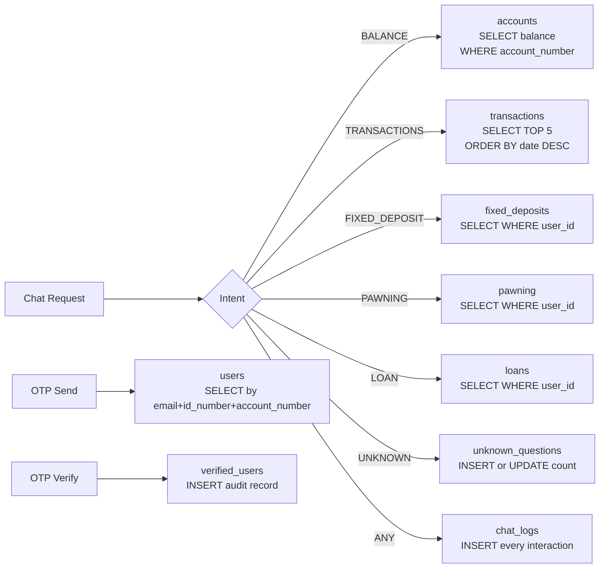

# Database Diagram — Smart Banking Assistant

## Overview

The `banking_chatbot` database consists of **10 tables** applied via 4 versioned migrations.

| Migration                                             | Tables Added                                                          |
| ----------------------------------------------------- | --------------------------------------------------------------------- |
| `V001__initial_schema.sql`                            | `users`, `accounts`, `transactions`, `chat_logs`, `unknown_questions` |
| `V002__add_loans_fd_pawning_tables_and_seed_data.sql` | `loans`, `loan_repayments`, `fixed_deposits`, `pawning`               |
| `V003__add_verified_users.sql`                        | `verified_users`                                                      |
| `V004__add_id_number_to_users.sql`                    | `id_number` column → `users`                                          |

---

## Entity Relationship Diagram

```mermaid
erDiagram

    users {
        int         id              PK  "Auto-increment primary key"
        varchar     name                "Full name"
        varchar     email               "Registered email (unique)"
        varchar     id_number           "National ID / NIC (unique) — added V004"
        datetime    created_at          "Account creation timestamp"
    }

    accounts {
        int         id              PK  "Auto-increment primary key"
        int         user_id         FK  "References users.id"
        varchar     account_number      "Unique account number (e.g. ACC001)"
        decimal     balance             "Current balance"
        varchar     account_type        "savings | current | fixed"
        varchar     currency            "LKR | USD | EUR etc."
        varchar     status              "active | inactive | closed"
    }

    transactions {
        int         id              PK  "Auto-increment primary key"
        int         account_id      FK  "References accounts.id"
        decimal     amount              "Transaction amount"
        varchar     type                "credit | debit"
        varchar     description         "Human-readable description"
        varchar     reference_number    "Unique reference"
        datetime    date                "Transaction date/time"
        decimal     balance_after       "Running balance after transaction"
    }

    chat_logs {
        int         id              PK  "Auto-increment primary key"
        int         user_id             "Requesting user (nullable)"
        text        request_message     "Raw user input"
        text        response            "Bot reply"
        varchar     intent              "Detected intent tag"
        float       confidence          "ANN confidence score"
        datetime    created_at          "Log timestamp"
    }

    unknown_questions {
        int         id              PK  "Auto-increment primary key"
        text        question            "Unrecognised user question"
        int         count               "Occurrences (deduplication counter)"
        datetime    created_at          "First seen timestamp"
        varchar     status              "pending | reviewed | trained"
    }

    verified_users {
        int         id              PK  "Auto-increment primary key"
        varchar     email               "Verified user email"
        varchar     id_number           "Verified National ID"
        datetime    verified_at         "OTP verification timestamp"
    }

    loans {
        int         id              PK  "Auto-increment primary key"
        int         user_id         FK  "References users.id"
        varchar     loan_type           "personal | home | vehicle | business"
        decimal     amount              "Loan principal amount"
        decimal     interest_rate       "Annual interest rate (%)"
        int         tenure_months       "Loan term in months"
        varchar     status              "active | settled | overdue"
    }

    loan_repayments {
        int         id              PK  "Auto-increment primary key"
        int         loan_id         FK  "References loans.id"
        decimal     amount              "Repayment installment amount"
        date        due_date            "Payment due date"
        date        paid_date           "Actual payment date (nullable)"
        varchar     status              "pending | paid | overdue"
    }

    fixed_deposits {
        int         id              PK  "Auto-increment primary key"
        int         user_id         FK  "References users.id"
        decimal     amount              "Principal deposit amount"
        decimal     interest_rate       "Annual interest rate (%)"
        int         tenure_months       "FD term in months"
        date        maturity_date       "Date FD matures"
        varchar     status              "active | matured | withdrawn"
    }

    pawning {
        int         id              PK  "Auto-increment primary key"
        int         user_id         FK  "References users.id"
        text        item_description    "Description of pawned item"
        decimal     appraised_value     "Bank-assessed item value"
        decimal     loan_amount         "Amount lent against item"
        decimal     interest_rate       "Monthly interest rate (%)"
        varchar     status              "active | redeemed | forfeited"
    }

    %% Relationships
    users           ||--o{ accounts          : "has"
    accounts        ||--o{ transactions      : "has"
    users           ||--o{ loans             : "has"
    loans           ||--o{ loan_repayments   : "has"
    users           ||--o{ fixed_deposits    : "has"
    users           ||--o{ pawning           : "has"
```

---

## Table Descriptions

### `users`

Core identity table. Each row represents a registered bank customer. The `id_number` (NIC) field was added in V004 and is required for OTP identity verification.

### `accounts`

Bank accounts linked to users. A single user may have multiple accounts (savings, current, etc.). The `account_number` is the primary identifier used in chat requests.

### `transactions`

Full transaction history per account. Each row records a single credit or debit event with a running `balance_after` snapshot.

### `chat_logs`

Audit trail of every chatbot interaction. Stores raw input, full reply, detected intent, and ANN confidence score. Used for monitoring and debugging.

### `unknown_questions`

Self-learning table. Queries that score `UNKNOWN` are stored here with deduplication — repeated questions increment the `count` column rather than creating duplicate rows. Reviewed questions can be promoted to `intents/intents.json` for the next model training run.

### `verified_users`

Audit record of completed OTP verifications. Stores the email and National ID that were verified. Does not store OTPs (those are held in server memory with a 5-minute TTL only).

### `loans`

Customer loan records including type, principal, interest rate, tenure, and status.

### `loan_repayments`

Instalment schedule for each loan. Each row is one repayment with due date, paid date, and status.

### `fixed_deposits`

Fixed deposit records including amount, interest rate, tenure, maturity date, and redemption status.

### `pawning`

Pawning/gold loan records. Each row records the pawned item, its appraised value, the loan issued against it, and current redemption status.

---

## Key Constraints

| Table                       | Column             | Constraint                    |
| --------------------------- | ------------------ | ----------------------------- |
| `users`                     | `email`            | UNIQUE                        |
| `users`                     | `id_number`        | UNIQUE                        |
| `accounts`                  | `account_number`   | UNIQUE                        |
| `transactions`              | `reference_number` | UNIQUE                        |
| `loans` → `loan_repayments` | `loan_id`          | FOREIGN KEY ON DELETE CASCADE |
| `users` → `accounts`        | `user_id`          | FOREIGN KEY                   |
| `users` → `loans`           | `user_id`          | FOREIGN KEY                   |
| `users` → `fixed_deposits`  | `user_id`          | FOREIGN KEY                   |
| `users` → `pawning`         | `user_id`          | FOREIGN KEY                   |

---

## OTP Verification — Not Stored in DB

> OTP codes are **not** stored in the database. They are held in a Python in-memory dictionary (`_otp_store`) in `routes/account.py` with a 5-minute TTL. Only the completed verification audit record is written to `verified_users`.

---

## Data Flow Summary

