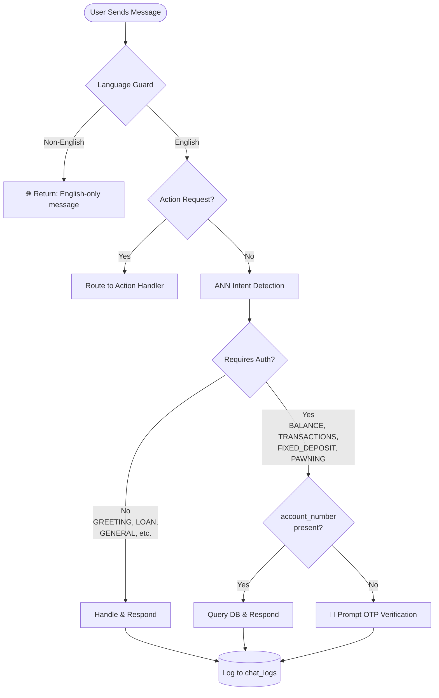

# Use Case Diagram — Smart Banking Assistant

## Actors

| Actor              | Description                                                                            |
| ------------------ | -------------------------------------------------------------------------------------- |
| **Guest User**     | Any user who has not completed OTP identity verification                               |
| **Verified User**  | A user who has passed 3-factor OTP verification (email + National ID + account number) |
| **System**         | The Smart Banking Assistant backend (FastAPI + ANN)                                    |
| **Email Server**   | External SMTP server used to deliver OTP codes                                         |
| **MySQL Database** | Stores users, accounts, transactions, logs, and more                                   |

---

## Use Case Diagram

```mermaid
graph TD
    subgraph Actors
        GU(["👤 Guest User"])
        VU(["🔐 Verified User"])
        ES(["📧 Email Server"])
        DB(["🗄️ MySQL Database"])
    end

    subgraph UC_Public["Public Use Cases (No Auth Required)"]
        UC1["💬 Send Greeting"]
        UC2["👋 Say Goodbye"]
        UC3["🌟 Ask Capabilities"]
        UC4["🏦 Ask Loan Information"]
        UC5["📅 Ask FD Rates"]
        UC6["🕐 Ask General Info\n(hours, branches, contact)"]
        UC7["💸 Ask Transfer Information"]
        UC8["💳 Ask Fees & Limits"]
        UC9["📱 Ask Digital Banking Help"]
        UC10["🃏 Ask Card Information"]
        UC11["📈 Ask Investment Info"]
        UC12["📊 Ask Credit Score Guidance"]
        UC13["📝 File a Complaint"]
        UC14["💱 Ask Foreign Exchange Rates"]
        UC15["🔐 Ask Security Help\n(lost card, password reset)"]
        UC16["📧 Ask About Forgotten Email"]
        UC17["🌐 Send Non-English Message\n→ Politely Declined"]
    end

    subgraph UC_Verify["Identity Verification Use Case"]
        UC18["🔑 Verify Identity via OTP\n(email + NIC + account number)"]
        UC18a["📤 Receive OTP Email"]
        UC18b["✅ Enter OTP Code"]
    end

    subgraph UC_Auth["Authenticated Use Cases (Requires Verification)"]
        UC19["💰 Check Account Balance"]
        UC20["📋 View Transaction History"]
        UC21["📅 View Personal FD Records"]
        UC22["🏠 View Pawning Ticket Records"]
    end

    subgraph UC_System["System Use Cases (Automatic)"]
        UC23["💾 Log Every Chat Interaction"]
        UC24["📚 Save Unknown Questions\nfor Model Improvement"]
        UC25["🔁 Context-Aware Follow-up"]
        UC26["🚫 Language Guard Check"]
    end

    %% Guest User connections
    GU --> UC1
    GU --> UC2
    GU --> UC3
    GU --> UC4
    GU --> UC5
    GU --> UC6
    GU --> UC7
    GU --> UC8
    GU --> UC9
    GU --> UC10
    GU --> UC11
    GU --> UC12
    GU --> UC13
    GU --> UC14
    GU --> UC15
    GU --> UC16
    GU --> UC17
    GU --> UC18

    %% OTP flow
    UC18 --> UC18a
    UC18a --> ES
    UC18 --> UC18b
    UC18 --> VU

    %% Verified user connections
    VU --> UC19
    VU --> UC20
    VU --> UC21
    VU --> UC22
    VU --> UC1
    VU --> UC2
    VU --> UC3
    VU --> UC4
    VU --> UC5
    VU --> UC6

    %% System automatic use cases
    UC1 & UC2 & UC19 & UC20 --> UC23
    UC1 --> UC25
    GU --> UC26
    VU --> UC26

    %% DB interactions
    UC19 --> DB
    UC20 --> DB
    UC21 --> DB
    UC22 --> DB
    UC18 --> DB
    UC24 --> DB
    UC23 --> DB
```

---

## Use Case Descriptions

### UC-01: Send Greeting

- **Actor**: Guest / Verified User
- **Description**: User sends a greeting message ("Hello", "Hi", "Good morning"). System responds with a friendly welcome.
- **Precondition**: None
- **Postcondition**: Chat logged

### UC-02: Say Goodbye

- **Actor**: Guest / Verified User
- **Description**: User says farewell ("Bye", "Thank you for your support"). System responds with a warm sign-off.
- **Precondition**: None
- **Postcondition**: Chat logged

### UC-03: Ask Capabilities

- **Actor**: Guest / Verified User
- **Description**: User asks what the chatbot can do. System returns a full capability list with emojis.
- **Precondition**: None

### UC-04 to UC-16: General Banking Queries

- **Actor**: Guest / Verified User
- **Description**: User asks about various banking topics (loans, FD rates, hours, fees, etc.). System returns relevant information without requiring authentication.
- **Precondition**: None

### UC-17: Send Non-English Message

- **Actor**: Any User
- **Description**: User sends a message in a non-English language (Sinhala, Arabic, French, etc.). System detects this via Unicode range check + `langdetect` and politely responds in English only.
- **Precondition**: None
- **Postcondition**: `UNSUPPORTED_LANGUAGE` intent returned; no DB query

### UC-18: Verify Identity via OTP

- **Actor**: Guest User
- **Extension Points**: Sends OTP via Email Server; validates against MySQL DB
- **Description**:
  1. User provides email, National ID, and account number
  2. System validates credentials against DB
  3. System generates a 6-digit OTP (5-minute TTL)
  4. OTP is emailed to the user
  5. User enters OTP
  6. On success → Verified User status granted; `user_id` + `account_number` returned
- **Precondition**: Valid registered account
- **Postcondition**: User can access authenticated use cases (UC-19 to UC-22)

### UC-19: Check Account Balance

- **Actor**: Verified User
- **Description**: User asks for their account balance. System queries MySQL and returns formatted balance with emoji.
- **Precondition**: OTP verification complete; `account_number` present in request
- **Postcondition**: Balance returned; chat logged

### UC-20: View Transaction History

- **Actor**: Verified User
- **Description**: User requests recent transactions. System fetches last 5 transactions from MySQL and formats them with 🟢/🔴 credit/debit indicators.
- **Precondition**: OTP verification complete
- **Postcondition**: Transaction list returned; chat logged

### UC-21: View Personal FD Records

- **Actor**: Verified User
- **Description**: User asks about their fixed deposits. System retrieves FD records from MySQL.
- **Precondition**: OTP verification complete

### UC-22: View Pawning Ticket Records

- **Actor**: Verified User
- **Description**: User enquires about their pawning tickets. System retrieves records from MySQL.
- **Precondition**: OTP verification complete

### UC-23: Log Every Chat Interaction (System)

- **Actor**: System (automatic)
- **Description**: Every request and response is saved to the `chat_logs` table regardless of intent.

### UC-24: Save Unknown Questions (System)

- **Actor**: System (automatic)
- **Description**: When intent is `UNKNOWN`, the question is saved to `unknown_questions` table with deduplication (count incremented for duplicates).

### UC-25: Context-Aware Follow-up (System)

- **Actor**: System (automatic)
- **Description**: If the current message is ambiguous but `last_intent` is provided, system attempts to answer in context of the previous intent.

### UC-26: Language Guard Check (System)

- **Actor**: System (automatic)
- **Description**: Every message passes through Unicode range detection and `langdetect` before NLP processing. Non-English triggers `UNSUPPORTED_LANGUAGE`.

---

## Authentication Decision Tree

